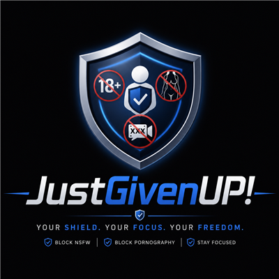

<p align="center">
  
</p>

<h1 align="center">JustGivenUp! - Screen Guardian</h1>

<p align="center">
  <b>A tamper-proof Windows screen guardian with AI-powered NSFW detection, smart filtering, and a cryptographic time-lock that stops you from quitting.</b>
</p>

<p align="center">
  <a href="https://github.com/RaGAEIDOS/justgivenup/releases/latest"></a>
  <a href="https://github.com/RaGAEIDOS/justgivenup/releases/tag/v2.0"></a>
  <a href="LICENSE"></a>
  <a href="https://github.com/RaGAEIDOS/justgivenup"></a>
</p>

<p align="center">
  <a href="https://github.com/RaGAEIDOS/justgivenup/issues/new?template=bug_report.md">Report Bug</a>
  ·
  <a href="https://github.com/RaGAEIDOS/justgivenup/issues/new?template=feature_request.md">Request Feature</a>
  ·
  <a href="https://github.com/RaGAEIDOS/justgivenup/discussions">Ask a Question</a>
</p>

---

## Why JustGivenUp?

Every day, millions of people lose hours of their lives to content they regret consuming. Willpower alone is not enough -- when impulse strikes, even the best intentions crumble. JustGivenUp was built for those moments. It is not a content blocker you can dismiss in two clicks. It is a **commitment device**: once you lock it, you cannot stop it until the timer runs out. No registry hack, no task manager trick, no emergency override will save you. The only way out is through.

This is not surveillance. This is **self-respect in code form**. Set your goal, lock yourself in, and come out the other side knowing you kept your word.

---

## Quick Download

<p align="center">
  <a href="https://github.com/RaGAEIDOS/justgivenup/releases/download/v2.0/JustGivenUp-v2.0-win64.zip">
    
  </a>
</p>

<p align="center">
  <code>JustGivenUp-v2.0-win64.zip</code> -- Portable, no install required. Unzip and run.
</p>

### Or install via PowerShell (Admin)

```powershell
powershell -ExecutionPolicy Bypass -File install.ps1
```

---

## Features

| Capability | Detail |
|---|---|
| **AI NSFW Detection** | Screen capture via GDI `BitBlt` every 3s, NudeNet `320n.onnx` inference via ONNX Runtime 1.26 |
| **Browser Termination** | Kills Chrome, Edge, Firefox, Brave, Opera via `TerminateProcess` |
| **Smart Filtering** | Whitelist (edu/YouTube/Udemy) skips detection; blacklist (proxy/.ru/porn/streaming) kills instantly |
| **All-Window Scan** | `EnumWindows` checks every visible window title, not just foreground |
| **Cryptographic Time-Lock** | SHA-256 sealed via BCrypt in registry; tampering adds 90 days |
| **Exit Prevention** | Stop/Exit grayed when locked, Alt+F4 blocked, `--emergency-stop` refused |
| **Watchdog** | Separate process auto-restarts guardian if killed |
| **Hidden Console** | CLI accessible in PowerShell; console hides programmatically in normal mode |
| **Custom Tray Icon** | Shield icon visible in system tray with countdown display |

---

## CLI Commands

```
JustGivenUp.exe                        Run with system tray
JustGivenUp.exe --install               Add to Windows startup
JustGivenUp.exe --remove                Remove from Windows startup
JustGivenUp.exe --lock--DAYS            Lock for N days (3 confirmations required)
JustGivenUp.exe --emergency-stop        Kill all JustGivenUp processes
JustGivenUp.exe --help                  Show help
```

---

## Quick Start

1. **Download** the [latest release](https://github.com/RaGAEIDOS/justgivenup/releases/latest)
2. Run `JustGivenUp.exe --lock--30` to lock for 30 days (type `YES` 3 times)
3. Reboot -- the program starts automatically via Registry Run key
4. Tray icon shows countdown; Stop/Exit are grayed out while locked

---

## How It Works

```
                   +------------------+
                   |  EnumWindows     |
                   |  (all windows)   |
                   +--------+---------+
                            |
                    +-------v--------+
                    |    Filter      |
                    |  (title match) |
                    +-------+--------+
                            |
              +-------------+-------------+
              |                           |
       SKIP / LENIENT              BLACKLIST HIT
              |                           |
      +-------v--------+         +--------v--------+
      |    Capture     |         |    Browser      |
      |  (BitBlt 3s)  |         |    Killer       |
      +-------+-------+         |  (TerminateProc)|
              |                 +-----------------+
      +-------v--------+
      |   Detector     |
      |  (ONNX RT)     |
      +-------+--------+
              |
       +------v------+
       |  NSFW?      |
       +------+------+
              |
    +---------+---------+
    |                   |
   YES                 NO
    |                   |
    v                   v
+-----------+     +-----------+
|  Browser  |     |   Sleep   |
|  Killer   |     |   3 sec   |
+-----------+     +-----------+
```

---

## Configuration

Config is stored at `%APPDATA%\JustGivenUp\config.json`:

| Key | Default | Description |
|---|---|---|
| `interval_seconds` | `3` | Seconds between screen captures |
| `nsfw_threshold` | `0.45` | Detection confidence threshold (0-1) |
| `cooldown_seconds` | `10` | Cooldown after a browser kill |
| `browsers` | `chrome,firefox,msedge,brave,opera` | Target browser executables |
| `whitelist_skip` | `youtube,udemy,coursera,...` | Sites that skip detection entirely |
| `whitelist_lenient` | *(empty)* | Sites with a higher threshold |
| `blacklist_kill` | `proxy,porn,streaming,.ru,...` | Sites that trigger instant browser kill |

---

## Security Model

- **Time-Lock**: Lock duration is sealed with SHA-256 via BCrypt. The registry stores a Unix timestamp and HMAC-SHA256 seal. Tampering with either value is detected and adds 90 days.
- **No DNS blocking**: Browser processes are terminated directly. No network filtering.
- **Watchdog**: `JustGivenUp_watchdog.exe` polls every 8 seconds and restarts the main process if killed.
- **Locked Exit Prevention**: Stop/Exit grayed out, Alt+F4 blocked, `--emergency-stop` refused.
- **Tamper Logging**: All tamper attempts are logged to `%APPDATA%\JustGivenUp\guardian.log`.

---

## Building from Source

### Requirements

- MSYS2 MinGW-w64 GCC 16.1.0+
- CMake 4.3.3+
- ONNX Runtime 1.26 (MSYS2 `ucrt64`)

### Build

```bash
mkdir build && cd build
cmake .. -G "MinGW Makefiles"
mingw32-make -j$(nproc)
```

The `build/` directory will contain both executables and all required DLLs.

---

## Roadmap

- [ ] Per-application whitelist/blacklist (allow games, block browsers during work hours)
- [ ] Schedule-based locking (lock every night 10pm-6am)
- [ ] Remote monitoring via encrypted telemetry
- [ ] QR code unlock with remote approval
- [ ] Linux support via X11/Wayland screen capture
- [ ] GUI configuration editor

---

## License

Distributed under the MIT License. See `LICENSE` for more information.

---

<p align="center">
  <b>JustGivenUp!</b> -- Because the version of you that sets the lock knows better than the version of you that wants to break it.
</p>

<p align="center">
  <a href="https://github.com/RaGAEIDOS/justgivenup">
    
  </a>
</p>
