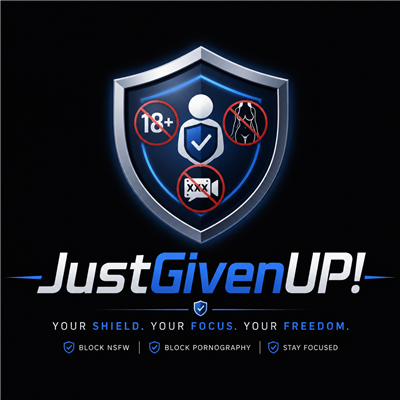

<p align="center">
  
</p>

<h1 align="center">JustGivenUp! - Screen Guardian</h1>

<p align="center">
  <b>A tamper-proof Windows screen guardian with AI-powered NSFW detection, smart filtering, and a cryptographic time-lock that stops you from quitting.</b>
</p>

<p align="center">
  <a href="https://github.com/RaGAEIDOS/justgivenup/releases/latest"></a>
  <a href="https://github.com/RaGAEIDOS/justgivenup/releases/tag/v2.1"></a>
  <a href="LICENSE"></a>
  <a href="https://github.com/RaGAEIDOS/justgivenup"></a>
</p>

<p align="center">
  <a href="https://github.com/RaGAEIDOS/justgivenup/issues/new?template=bug_report.md">Report Bug</a>
  ·
  <a href="https://github.com/RaGAEIDOS/justgivenup/issues/new?template=feature_request.md">Request Feature</a>
  ·
  <a href="https://github.com/RaGAEIDOS/justgivenup/discussions">Ask a Question</a>
</p>

---

## Why JustGivenUp?

Every day, millions of people lose hours of their lives to content they regret consuming. Willpower alone is not enough -- when impulse strikes, even the best intentions crumble. JustGivenUp was built for those moments. It is not a content blocker you can dismiss in two clicks. It is a **commitment device**: once you lock it, you cannot stop it until the timer runs out. No registry hack, no task manager trick, no emergency override will save you. The only way out is through.

This is not surveillance. This is **self-respect in code form**. Set your goal, lock yourself in, and come out the other side knowing you kept your word.

---

## Quick Download

<p align="center">
  <a href="https://github.com/RaGAEIDOS/justgivenup/releases/download/v2.1/JustGivenUp-v2.1-win64.zip">
    
  </a>
</p>

<p align="center">
  <code>JustGivenUp-v2.1-win64.zip</code> -- Portable, no install required. Unzip and run.
</p>

### Or install via PowerShell (Admin)

```powershell
powershell -ExecutionPolicy Bypass -File install.ps1
```

---

## Features

| Capability | Detail |
|---|---|
| **AI NSFW Detection** | Screen capture via GDI `BitBlt` every 3s, NudeNet `320n.onnx` inference via ONNX Runtime 1.26 |
| **Tab Close (not kill)** | Warns before closing via Ctrl+W instead of killing browser process. Supports 30+ browsers |
| **Warning Dialog** | System-modal YES/NO dialog on blacklist/NSFW hit — "Go Back" closes tab, "Continue" logs relapse |
| **Smart Filtering** | Massive whitelist (200+ edu/dev platforms) skips detection; blacklist (proxy/VPN/porn/streaming/.ru) warns instantly |
| **All-Window Scan** | `EnumWindows` checks every visible window title, not just foreground |
| **Web Dashboard** | Local HTTP server on port 8081 with live stats (clean days, blocked count, streak, lock status) |
| **Stats Tracking** | Blocked count, relapses, streaks, warning history saved to `%APPDATA%\JustGivenUp\stats.json` |
| **Cryptographic Time-Lock** | SHA-256 sealed via BCrypt in registry; tampering adds 90 days |
| **Exit Prevention** | Stop/Exit grayed when locked, Alt+F4 blocked, `--emergency-stop` refused |
| **Watchdog** | Separate process auto-restarts guardian if killed |
| **Hidden Console** | CLI accessible in PowerShell; console hides programmatically in normal mode |
| **Custom Tray Icon** | Shield icon visible in system tray with countdown display |

---

## CLI Commands

```
JustGivenUp.exe                        Run with system tray
JustGivenUp.exe --install               Add to Windows startup
JustGivenUp.exe --remove                Remove from Windows startup
JustGivenUp.exe --lock--DAYS            Lock for N days (3 confirmations required)
JustGivenUp.exe --emergency-stop        Kill all JustGivenUp processes
JustGivenUp.exe --help                  Show help
```

---

## Quick Start

1. **Download** the [latest release](https://github.com/RaGAEIDOS/justgivenup/releases/latest)
2. Run `JustGivenUp.exe --lock--30` to lock for 30 days (type `YES` 3 times)
3. Reboot -- the program starts automatically via Registry Run key
4. Tray icon shows countdown; Stop/Exit are grayed out while locked

---

## How It Works

```
                   +------------------+
                   |  EnumWindows     |
                   |  (all windows)   |
                   +--------+---------+
                            |
                    +-------v--------+
                    |    Filter      |
                    |  (title match) |
                    +-------+--------+
                            |
              +-------------+-------------+
              |                           |
       SKIP / LENIENT              BLACKLIST HIT
              |                           |
      +-------v--------+         +--------v--------+
      |    Capture     |         |    Browser      |
      |  (BitBlt 3s)  |         |    Killer       |
      +-------+-------+         |  (TerminateProc)|
              |                 +-----------------+
      +-------v--------+
      |   Detector     |
      |  (ONNX RT)     |
      +-------+--------+
              |
       +------v------+
       |  NSFW?      |
       +------+------+
              |
    +---------+---------+
    |                   |
   YES                 NO
    |                   |
    v                   v
+-----------+     +-----------+
|  Browser  |     |   Sleep   |
|  Killer   |     |   3 sec   |
+-----------+     +-----------+
```

---

## Configuration

Config is stored at `%APPDATA%\JustGivenUp\config.json`:

| Key | Default | Description |
|---|---|---|
| `interval_seconds` | `3` | Seconds between screen captures |
| `nsfw_threshold` | `0.45` | Detection confidence threshold (0-1) |
| `cooldown_seconds` | `10` | Cooldown after a browser kill |
| `browsers` | `chrome,firefox,msedge,brave,opera` | Target browser executables |
| `whitelist_skip` | `youtube,udemy,coursera,...` | Sites that skip detection entirely |
| `whitelist_lenient` | *(empty)* | Sites with a higher threshold |
| `blacklist_kill` | `proxy,porn,streaming,.ru,...` | Sites that trigger instant browser kill |

---

## Security Model

- **Time-Lock**: Lock duration is sealed with SHA-256 via BCrypt. The registry stores a Unix timestamp and HMAC-SHA256 seal. Tampering with either value is detected and adds 90 days.
- **No DNS blocking**: Browser processes are terminated directly. No network filtering.
- **Watchdog**: `JustGivenUp_watchdog.exe` polls every 8 seconds and restarts the main process if killed.
- **Locked Exit Prevention**: Stop/Exit grayed out, Alt+F4 blocked, `--emergency-stop` refused.
- **Tamper Logging**: All tamper attempts are logged to `%APPDATA%\JustGivenUp\guardian.log`.

---

## Building from Source

### Requirements

- MSYS2 MinGW-w64 GCC 16.1.0+
- CMake 4.3.3+
- ONNX Runtime 1.26 (MSYS2 `ucrt64`)

### Build

```bash
mkdir build && cd build
cmake .. -G "Ninja"
ninja
```

The `build/` directory will contain both executables and all required DLLs.

---

## Roadmap

- [ ] Per-application whitelist/blacklist (allow games, block browsers during work hours)
- [ ] Schedule-based locking (lock every night 10pm-6am)
- [ ] Remote monitoring via encrypted telemetry
- [ ] QR code unlock with remote approval
- [ ] Linux support via X11/Wayland screen capture
- [ ] GUI configuration editor

---

## License

Distributed under the MIT License. See `LICENSE` for more information.

---

<p align="center">
  <b>JustGivenUp!</b> -- Because the version of you that sets the lock knows better than the version of you that wants to break it.
</p>

---

## 🇸🇦 النسخة العربية

**JustGivenUp!** — برنامج حماية شاشة لنظام ويندوز، يعمل بالذكاء الاصطناعي لكشف المحتوى غير المناسب، مع فلتر ذكي وقفل زمني مشفر يمنعك من إيقافه.

### لماذا JustGivenUp!؟

كل يوم، يخسر ملايين الأشخاص ساعات من أعمارهم أمام محتوى يندمون عليه. قوة الإرادة وحدها لا تكفي — فعندما تأتي اللحظة، تنهار أحسن النوايا. هذا البرنامج صُمم لتلك اللحظات. إنه ليس مجرد مانع محتوى يمكنك إغلاقه بنقرتين. إنه **جهاز التزام**: بمجرد أن تقفله، لا يمكنك إيقافه حتى ينتهي المؤقت. لا اختراق ريجستري، ولا مدير مهام، ولا طوارئ ستنقذك. الطريق الوحيد للخروج هو الانتظار حتى النهاية.

هذه ليست مراقبة. هذا **احترام للذات في صورة كود**. حدد هدفك، اقفل نفسك، واخرج من الجانب الآخر وأنت تعرف أنك وفيت بوعدك.

### المميزات

| الميزة | الشرح |
|---|---|
| **كشف NSFW بالذكاء الاصطناعي** | تصوير الشاشة كل 3 ثوانٍ عبر GDI `BitBlt`، تحليل بنموذج NudeNet `320n.onnx` عبر ONNX Runtime |
| **إغلاق التبويبات بدلاً من قتل المتصفح** | يحاكي الضغط على Ctrl+W لإغلاق التبويب المخالف مع نافذة تحذير |
| **فلتر ذكي** | قائمة بيضاء ضخمة (200+ موقع تعليمي) تتجاوز الفحص؛ قائمة سوداء (بروكسي، VPN، إباحي، رقص، .ru) تغلق التبويب فوراً |
| **لوحة تحكم ويب** | dashboard محلي على `http://127.0.0.1:8081` يعرض إحصائيات حية (أيام نظيفة، حالات انتكاس، السلسلة) |
| **القفل الزمني المشفر** | SHA-256 عبر BCrypt في الريجستري؛ العبث يضيف 90 يوماً إضافية |
| **منع الخروج** | زر الإيقاف/الخروج معطل عند القفل، Alt+F4 محظور، `--emergency-stop` مرفوض |
| **حارس (Watchdog)** | عملية منفصلة تعيد تشغيل البرنامج تلقائياً إذا تم إيقافه |
| **دعم جميع المتصفحات** | Chrome, Firefox, Edge, Brave, Opera, Vivaldi, Tor, Yandex, Arc, وغيرها (30+ متصفح) |

### أوامر سطر الأوامر

```
JustGivenUp.exe                             تشغيل عادي مع علبة النظام
JustGivenUp.exe --install                    إضافة إلى بدء تشغيل ويندوز
JustGivenUp.exe --remove                     إزالة من بدء تشغيل ويندوز
JustGivenUp.exe --lock--عددالأيام            قفل لعدد N من الأيام (يطلب تأكيد 3 مرات)
JustGivenUp.exe --emergency-stop             قتل جميع عمليات JustGivenUp
JustGivenUp.exe --help                       عرض المساعدة
```

### بدء سريع

1. **حمّل** [آخر إصدار](https://github.com/RaGAEIDOS/justgivenup/releases/latest)
2. شغّل `JustGivenUp.exe --lock-30` لقفل 30 يوماً (اكتب `YES` ثلاث مرات)
3. أعد التشغيل — البرنامج يبدأ تلقائياً
4. أيقونة في علبة النظام تظهر العد التنازلي؛ زر الإيقاف/الخروج معطل أثناء القفل
5. افتح `http://127.0.0.1:8081` لمشاهدة الإحصائيات الحية

### لوحة التحكم (Dashboard)

عند تشغيل البرنامج، افتح المتصفح على `http://127.0.0.1:8081` لترى:
- عدد الأيام النظيفة (منذ آخر انتكاسة)
- عدد المرات التي تم فيها حظر محتوى
- عدد حالات الانتكاس (عندما ضغطت "متابعة" رغم التحذير)
- سلسلة الانتكاسات الأطول
- سلسلة النظافة الأطول (أطول فترة بدون انتكاسة)
- حالة القفل (مقفل / مفتوح)

### كيف يعمل

1. **مسح جميع النوافذ**: يفحص `EnumWindows` عناوين جميع النوافذ المفتوحة
2. **الفلتر**: إذا كان الموقع في القائمة البيضاء → يتجاوز الفحص؛ في القائمة السوداء → تحذير فوري
3. **الكشف بالذكاء الاصطناعي**: إذا كان الموقع غير معروف، يصور الشاشة ويحللها بنموذج NudeNet
4. **الإجراء**: عند اكتشاف محتوى غير مناسب أو موقع محظور → نافذة تحذير ("عد إلى الخلف" أو "متابعة")
   - إذا ضغطت "عد إلى الخلف" ← يغلق التبويب (Ctrl+W)
   - إذا ضغطت "متابعة" ← يسجل انتكاسة ويستمر

### نموذج الأمان

- **القفل الزمني**: مدة القفل مشفرة بـ SHA-256 عبر BCrypt. الريجستري يخزن طابع زمني مع HMAC-SHA256. العبث بأي قيمة يُكتشف ويضيف 90 يوماً
- **بدون حجب DNS**: لا يتم إنهاء المتصفحات مباشرة، بل تغلق التبويبات المخالفة فقط
- **الحارس**: `JustGivenUp_watchdog.exe` يفحص كل 8 ثوانٍ ويعيد تشغيل البرنامج إذا تم إيقافه
- **تسجيل الاختراق**: كل محاولات العبث تُسجل في `%APPDATA%\JustGivenUp\guardian.log`

### بناء من المصدر

**المتطلبات**: MSYS2 MinGW-w64 GCC 16.1.0+, CMake 4.3.3+, ONNX Runtime 1.26

```bash
mkdir build && cd build
cmake .. -G "Ninja"
ninja
```

### الترخيص

موزع تحت رخصة MIT. انظر ملف `LICENSE` للمزيد.

### التحميل

<p align="center" dir="rtl">
  <a href="https://github.com/RaGAEIDOS/justgivenup/releases/latest">
    
  </a>
</p>

<p align="center" dir="rtl">
  <b>JustGivenUp!</b> — لأن نسخة نفسك التي تضع القفل أعقل من النسخة التي تريد كسره.
</p>

<p align="center">
  <a href="https://github.com/RaGAEIDOS/justgivenup">
    
  </a>
</p>
